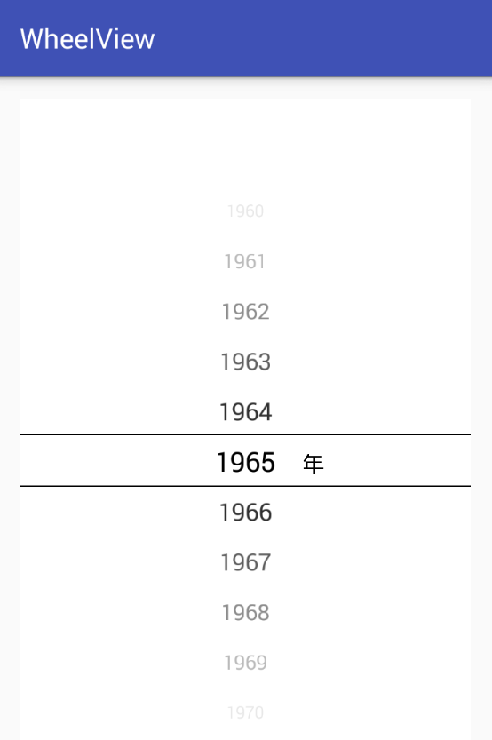

# WheelView
基于RecycleView写的一个WheelView

# show you the code 

        dateWheel = (RecycleWheelView) findViewById(R.id.dateWheelView);
         
        dateWheel.setLabelTextColor(getResources().getColor(R.color.colorAccent));
        dateWheel.setLineColor(getResources().getColor(R.color.colorAccent));
        dateWheel.setVisibleItem(5);
        dateWheel.setLabel("cm");
        
        mAdapter = new WheelAdapter<>(this);
        List<String> dataList = new ArrayList<>();
        for (int i = 60; i < 240; i++) {
            dataList.add(String.format("%d", i));
        }
        mAdapter.setData(dataList);
        
        dateWheel.setAdapter(mAdapter);
        dateWheel.setSelectedItem(50);
        dateWheel.setOnSelectListener(new RecycleWheelView.OnSelectItemListener() {
                @Override
                public void onSelectChanged(int position) {
                    mAdapter.setSelectedIndex(position);
                    Toast.makeText(MainActivity.this, "index=" + position, Toast.LENGTH_SHORT).show();
                }
            });

            
 
# 目前支持的特性有

1. 加标签，定制颜色，大小等效果。例如图片显示的年
2. 设置是否渐显
3. 设置是否缩小`(curve)`
4. 显示的item数目
5. 中间选中的颜色和没选中的原色不一样功能(用丑陋的回调方式解决了)

# 存在的问题
1. 目前还不能自适应大小
   就是当设置只显示3个时候，不能动态调节ChildView的大小
2. 在设置为curve的时候，显示有些小问题,暂时不建议使用  
3. 

#  推荐
目前这个还在迭代，还有不少问题，今天看到一个更功能齐全的

[AndroidPicker](https://github.com/gzu-liyujiang/AndroidPicker)
 
